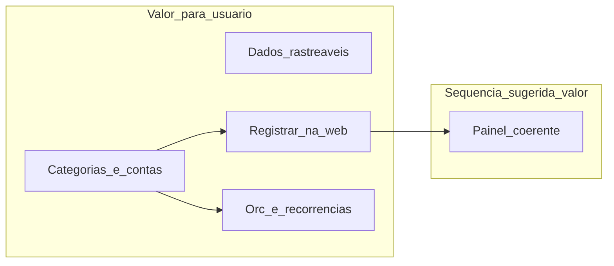

# Backlog Scrum — Finweb (visão de Product Owner)

Documento vivo para planejamento com Scrum (time de 3 pessoas). Complementa a visão de produto em [Descrição do Projeto.md](./Descrição%20do%20Projeto.md). Duração de sprint não está fixada neste artefato.

---

## Objetivo do produto

O **Finweb** ajuda pessoas com finanças desorganizadas a **retomar o controle** com segurança e clareza: contas, lançamentos, categorias, orçamentos e recorrências, com dados **sempre do próprio usuário**. A visão de longo prazo inclui assistência por IA e automação (ex.: n8n); este backlog foca em **confiabilidade percebida** e **fim dos conteúdos apenas ilustrativos** onde o usuário espera ver a própria vida financeira.

## Problema que estamos resolvendo agora

Hoje o usuário autenticado ainda encontra **telas que parecem ter dados**, mas são **cenários de demonstração**, ou **fluxos incompletos** (ex.: novo lançamento). Isso quebra confiança e impede uso real do produto. O critério central deste backlog: **o que aparece na tela reflete o cadastro e os movimentos daquele titular**, exceto onde o produto declarar claramente “conteúdo ilustrativo”.

## Princípios para o time Scrum (3 pessoas)

- **Backlog prioriza valor e risco de produto**, não arquivos ou camadas.
- **Refinamento** traduz histórias em tarefas técnicas (frontend, backend, banco) — isso fica nas sessões com o time, não como item principal deste documento.
- **Sem duração fixa de sprint** neste artefato; encaixe épicos/histórias nas sprints no Trello/ClickUp quando definirem cadência.

---

## Épico 1 — Transparência quando não há dados (e quando algo falha)

**Valor de negócio:** o usuário entende **em qual etapa está** (sem conta, sem lançamento, etc.) e **o que fazer a seguir**, em vez de ver números inventados.

**Histórias (exemplos de PBIs):**

| ID | História (formato negócio) | Critérios de aceite (resumo) |
|----|----------------------------|------------------------------|
| 1.1 | Como titular, quero ver **estado vazio claro** nas áreas principais (contas, transações, orçamentos, categorias, recorrências, gráficos), para saber que ainda preciso cadastrar algo. | Não há valores monetários ou listas “de exemplo” passando por dados reais; há mensagem + ação sugerida (CTA) onde fizer sentido. |
| 1.2 | Como titular, quando o carregamento falhar, quero **feedback compreensível** e possibilidade de tentar de novo, para não achar que o sistema “sumiu com meu dinheiro”. | Erro visível; linguagem em pt-BR acessível; não silenciar falha com layout de sucesso. |

**Dependências:** transversal; deve ser aplicado **à medida que** cada tela deixa de usar demonstração.

**Nota para refinamento:** impacto predominante em interface; padronizar copy e componentes de estado.

---

## Épico 2 — Categorias que respeitam o titular

**Valor de negócio:** o usuário **organiza gastos e receitas** com categorias **próprias** e, quando fizer sentido, **sugestões comuns do sistema**; **nenhuma categoria particular de outra pessoa aparece**.

**Histórias:**

| ID | História | Critérios de aceite (resumo) |
|----|----------|------------------------------|
| 2.1 | Como titular, quero **ver minhas categorias e as sugeridas pelo produto** (receita/despesa), para classificar lançamentos sem começar do zero. | Lista reflete API/dados reais; filtros por tipo funcionam; categorias “do sistema” distinguíveis das minhas. |
| 2.2 | Como titular, quero **criar, editar e excluir categorias minhas**, para refletir meu estilo de vida. | CRUD apenas onde a regra de negócio permitir; exclusão/edit protegida para categorias globais/sistema. |
| 2.3 | Como titular, quero **garantia de privacidade**: só vejo categorias públicas do catálogo + as minhas. | Comportamento validado com dois usuários de teste (aceite pode ser cenário de QA descrito pelo PO). |

**Dependências:** necessário **antes ou em paralelo** ao lançamento completo de transações que exigem categoria.

**Nota para refinamento:** regras de isolamento e catálogo global já descritas em documentação técnica do projeto; validar apenas mensagens de erro amigáveis.

---

## Épico 3 — Contas reais e patrimônio compreensível

**Valor de negócio:** o titular **cadastra onde o dinheiro está** e vê **totais coerentes** com o que cadastrou — sem “patrimônio de mentirinha”.

**Histórias:**

| ID | História | Critérios de aceite (resumo) |
|----|----------|------------------------------|
| 3.1 | Como titular **sem contas**, quero uma tela que me **convide a criar a primeira conta**, sem exibir instituições fictícias. | Nenhuma conta demonstrativa; métricas agregadas não usam valores placeholder. |
| 3.2 | Como titular, quero **incluir uma conta** (tipo, nome, moeda, saldo inicial, instituição, observações quando aplicável), para espelhar minha realidade. | Conta criada aparece na listagem; validações impedem dados inválidos com mensagem clara. |
| 3.3 | Como titular, quero **ajustar ou arquivar** uma conta quando minha vida financeira mudar. | Fluxo disponível conforme regra de produto (arquivamento vs. exclusão). |
| 3.4 | Como titular, não quero botões que **prometem relatório** sem entrega. | “Relatórios” removido, desabilitado com explicação, ou ligado a funcionalidade real (decisão de produto única). |

**Dependências:** recomendado **antes** de transferências entre contas no lançamento.

---

## Épico 4 — Lançamentos (transações) pela web

**Valor de negócio:** o titular **registra receita, despesa e transferência** sem depender de ferramentas externas ou API crus.

**Histórias:**

| ID | História | Critérios de aceite (resumo) |
|----|----------|------------------------------|
| 4.1 | Como titular, quero **criar um lançamento** escolhendo tipo, valor, data, conta(s), categoria quando obrigatória, e descrição, para manter o histórico atualizado. | Fluxo completo na interface; regras de negócio (ex.: transferência entre contas distintas, categoria em receita/despesa) respeitadas com mensagens claras. |
| 4.2 | Como titular, quero **validação antes de enviar**, para evitar erros bobos e entender o que corrigir. | Campos inválidos destacados; feedback de sucesso/erro após envio; experiência alinhada ao design system do produto. |
| 4.3 | Como titular, quero **ver meus lançamentos reais agrupados** (ex.: por dia) com filtro de período, sem lista fictícia. | Lista reflete apenas dados do usuário; vazio segue Épico 1. |
| 4.4 | Como titular, quero **editar ou excluir** um lançamento quando me equivoquei, se o produto oferecer isso. | Incluir ou explicitamente cortar do escopo com comunicação ao time na refinamento. |

**Dependências:** Épicos **2** (categorias) e **3** (contas) para selects significativos.

**Nota para refinamento:** camadas mistas se regras no servidor ou banco exigirem ajuste; PO traz exemplos de casos limite (transferência, valor zero, etc.).

---

## Épico 5 — Painel: “Como estou no período?”

**Valor de negócio:** respostas rápidas às perguntas: resultado no período, **onde gastei mais**, próximos compromissos — **sem misturar finanças com painel de investimentos falso**.

**Histórias:**

| ID | História | Critérios de aceite (resumo) |
|----|----------|------------------------------|
| 5.1 | Como titular, quero que **gráficos e totais** reflitam **meus** lançamentos no intervalo escolhido, ou estado vazio adequado. | Sem preenchimento “genérico” quando não há dados. |
| 5.2 | Como titular, quero que o **cabeçalho de resumo** esteja alinhado aos mesmos dados usados nas demais áreas, para não ver números contraditórios. | Regra de período e fonte de verdade documentada entre PO e time na refinamento. |
| 5.3 | Como titular, **não quero ser induzido a crer em cotações ou rentabilidades** que o produto não calcula. | Card ou seção “investimentos/market” removido, substituído por conteúdo útil (onboarding/dica), ou **rotulado de forma inequívoca** como ilustração não financeira pessoal. |

**Dependências:** fortemente beneficiado pelo Épico 4 (dados de lançamentos reais).

---

## Épico 6 — Orçamentos com progresso honesto

**Valor de negócio:** o titular **define limites por categoria e período** e vê **quanto já consumiu** do orçamento.

**Histórias:**

| ID | História | Critérios de aceite (resumo) |
|----|----------|------------------------------|
| 6.1 | Como titular, quero **criar e gerir orçamentos** ligados a categorias e períodos (mensal/anual conforme produto), sem listas demonstrativas. | Dados reais; conflitos do tipo “já existe orçamento para essa categoria no período” comunicados de forma clara. |
| 6.2 | Como titular, quero **ver progresso** (quanto já gastei vs. limite) **coerente com minhas despesas** naquele período. | Barra ou indicador reflete agregação acordada com o time; sem placeholder de progresso. |

**Dependências:** categorias reais (Épico 2); lançamentos de despesa (Épico 4) para o progresso fazer sentido.

---

## Épico 7 — Recorrências e vencimentos

**Valor de negócio:** o titular **anticipa contas e receitas fixas**; o painel de “próximos vencimentos” mostra **compromissos reais**.

**Histórias:**

| ID | História | Critérios de aceite (resumo) |
|----|----------|------------------------------|
| 7.1 | Como titular, quero **cadastrar e gerir recorrências** (valor, frequência, próxima data, conta, ativo/inativo). | Fluxo completo; validações compreensíveis. |
| 7.2 | Como titular, nas listas de recorrências (incluindo atalhos no painel), quero ver **apenas os meus compromissos**, ou estado vazio guiado. | Sem itens fictícios. |

**Dependências:** contas (Épico 3); opcionalmente categorias.

---

## Épico 8 — Onboarding que acompanha a realidade

**Valor de negócio:** o assistente de primeiros passos **reflete o que o usuário já fez**, evitando dicas inúteis ou permanece alinhado à decisão de “dispensar”.

**Histórias:**

| ID | História | Critérios de aceite (resumo) |
|----|----------|------------------------------|
| 8.1 | Como titular, quando **cadastrar contas / categorias / primeira transação**, quero que o produto **reconheça** esse progresso. | Estado de onboarding atualizado após ações reais; comportamento de “dispensar” preservado. |

**Dependências:** Épicos 3, 2 e 4 conforme o que o produto considera “passo concluído”.

---

## Épico 9 — Automação e ecossistema (futuro)

**Valor de negócio:** permitir que **serviços autorizados** integrem lançamentos ou consultas (ex.: n8n, agentes), sem comprometer segurança.

**Histórias (alto nível):**

- Como operador do produto, quero **documentação e testes** das integrações expostas, para reduzir risco em produção.
- Como negócio, quero **política clara de credenciais** (rotação, ambientes).

**Nota:** detalhar quando o roadmap de IA/automação for priorizado.

---

## Ordem sugerida de valor (recomendação de PO, não calendário)

1. **Épicos 1 + 3 + 2** — base confiável: contas e categorias reais, sem “dados de vitrine”.
2. **Épico 4** — lançamentos na web (momento em que o produto “fecha o loop”).
3. **Épicos 5, 6, 7** — painel, orçamentos e recorrências com dados consistentes.
4. **Épico 8** — onboarding sincronizado.
5. **Épico 9** — conforme prioridade estratégica.

Paralelização possível: após 2 e 3 iniciados, **6 e 7** podem avançar com **4** desde que o PO aceite risco de progresso de orçamento incompleto até haver despesas reais.

---

## Definição de Pronto (sugestão — visão de produto)

- A história cumpre **todos os critérios de aceite** acordados.
- Não há **mistura de dados demonstrativos** com dados do titular salvo decisão explícita de copy (“ilustração”).
- **Dois perfis de teste** (quando aplicável) validam isolamento de categorias/dados sensíveis.
- Comportamento verificado no ambiente que o PO considera “done” (ex.: staging).

---

## Como levar ao Trello / ClickUp

- **Um card por história** (ex.: 4.1, 4.2), não por arquivo.
- Campos custom sugeridos: **Épico**, **Valor (uma linha)**, **Critérios de aceite** (checklist), **Dependências**.
- Subtarefas técnicas (frontend, backend, banco) criadas **no refinamento**, dono definido pelo time.
- Tag opcional: `remove-demo` onde o escopo incluir retirada de conteúdo ilustrativo.

---

## Apêndice — refinamento técnico (para o time, não para priorização pelo PO)

O mapeamento de **componentes ou rotas** que ainda carregam demonstração pode ser levantado em uma **sessão única de descoberta** com desenvolvimento, a partir do repositório e da documentação em `docs/`. O PO mantém o **porquê** e o **o quê**; o time detalha o **como** e as **camadas** afetadas por história.

---

## Registro de sprints — Remoção de mocks (personal-finance)

Incremento único (entrega contínua): retirada de dados demonstrativos e de métricas inventadas no módulo `app/(dashboard)/personal-finance` e componentes em `app/components/PersonalFinance/`, com APIs em `app/api/personal-finance/`. **Data de referência:** 2026-05-12.

### Sprint 1 — Contas e vazio honesto

| Campo | Conteúdo |
|--------|-----------|
| **Objetivo** | Usuário sem contas não vê instituições fictícias; totais não usam placeholders. |
| **PBIs (backlog)** | 1.1, 3.1, 3.4 (botão Relatórios desabilitado com `title` até haver produto). |
| **Frontend** | [`app/components/PersonalFinance/pf-accounts-screen.tsx`](app/components/PersonalFinance/pf-accounts-screen.tsx): removidos `demoAccounts`, patrimônio fictício, `available` fixo, faixa de mercado (Ibovespa etc.); estado vazio com CTA. |
| **Backend** | Sem alteração funcional; revisão implícita na rota de contas existente. |
| **DoD** | Lista vazia só com empty state; com dados, apenas contas da API. |
| **Impedimentos** | ~~Fluxos “Nova Conta”~~ — ver subseção **Pós-mocks — CTAs de criação**. |

### Sprint 2 — Categorias e resumo real

| Campo | Conteúdo |
|--------|-----------|
| **Objetivo** | Categorias e painel lateral sem vitrine; copy em pt-BR e BRL. |
| **PBIs** | 1.1, 2.x, 5.1. |
| **Frontend** | [`pf-categories-screen.tsx`](app/components/PersonalFinance/pf-categories-screen.tsx): removidos `demo` / `demoInsights`; resumo do mês e “maiores despesas” via `usePfSummary` + `usePfCategories("expense")`. |
| **Backend** | Uso de [`GET /api/personal-finance/summary`](app/api/personal-finance/summary/route.ts) existente. |
| **DoD** | Estado vazio sem listas em inglês/USD; com dados, valores do período. |
| **Impedimentos** | Nenhum. |

### Sprint 3 — Transações

| Campo | Conteúdo |
|--------|-----------|
| **Objetivo** | Lista só com lançamentos do titular; conta exibida a partir de `account_id`. |
| **PBIs** | 4.3 (e alinhamento a 4.x). |
| **Frontend** | [`pf-transactions-screen.tsx`](app/components/PersonalFinance/pf-transactions-screen.tsx): removido array `demo`; `usePfAccounts` para nomes; sinal de valor por `kind` (despesa negativa na UI). |
| **Backend** | Sem mudança de contrato da lista (enriquecimento no cliente). |
| **DoD** | Vazio sem lançamentos fictícios; transferências mostram origem → destino quando houver `counterparty_account_id`. |
| **Impedimentos** | Nenhum. |

### Sprint 4 — Painel (dashboard)

| Campo | Conteúdo |
|--------|-----------|
| **Objetivo** | Painel sem rentabilidade de mercado nem gráficos estáticos enganosos. |
| **PBIs** | 5.1–5.3, 7.2, 1.2. |
| **Frontend** | [`app/(dashboard)/personal-finance/page.tsx`](app/(dashboard)/personal-finance/page.tsx): card de “investimentos” substituído por orientação honesta. [`pf-dashboard-header.tsx`](app/components/PersonalFinance/pf-dashboard-header.tsx): removidos `deltaPercent` e meta fixa. [`pf-by-category-chart.tsx`](app/components/PersonalFinance/pf-by-category-chart.tsx): removido `demoItems`; estado vazio; toggle “Semanal” desabilitado com tooltip. [`pf-recurring-list.tsx`](app/components/PersonalFinance/pf-recurring-list.tsx): vazio com link para recorrências. [`pf-result-over-time-chart.tsx`](app/components/PersonalFinance/pf-result-over-time-chart.tsx): série a partir da API. |
| **Backend** | [`summary/route.ts`](app/api/personal-finance/summary/route.ts): campo `cumulative_result_by_day` (resultado acumulado dia a dia; transferências fora do cálculo). Tipo [`PfSummaryResponse`](app/(dashboard)/modules/hooks/use-pf-summary.tsx) atualizado. |
| **DoD** | Gráfico temporal reflete transações do intervalo; donut sem fatias demo. |
| **Impedimentos** | Agregação “semanal” na UI permanece desligada até API suportar intervalo semanal. |

### Sprint 5 — Orçamentos

| Campo | Conteúdo |
|--------|-----------|
| **Objetivo** | Progresso e cartões alinhados a `pf_budgets` + despesas do mês. |
| **PBIs** | 6.1, 6.2. |
| **Frontend** | [`pf-budgets-screen.tsx`](app/components/PersonalFinance/pf-budgets-screen.tsx): removidos `demoTop` / `demoOther` e blocos fictícios (investimentos direcionados, membros, percentuais fixos); cartões por orçamento real; resumo com totais da API. |
| **Backend** | Nenhum endpoint novo; uso de `summary` + `budgets`. |
| **DoD** | Sem orçamentos: empty state; com orçamentos: `spent` por `expense_by_category_id`. |
| **Impedimentos** | Nenhum. |

### Pós-mocks — CTAs de criação (web)

**Data de referência:** 2026-05-12.

Entrega mínima na web para **criar** conta, lançamento, categoria, orçamento e recorrência: modais (`pf-create-*-modal.tsx`) com `POST` em `/api/personal-finance/...`, base visual em [`components/ui/modal.tsx`](components/ui/modal.tsx), `reload()` dos hooks após `201`, e links **Novo lançamento** no painel para `/personal-finance/transactions?new=1`. A tela de recorrências deixou de usar cartões/calendário fictícios; lista e totais refletem só dados da API.
